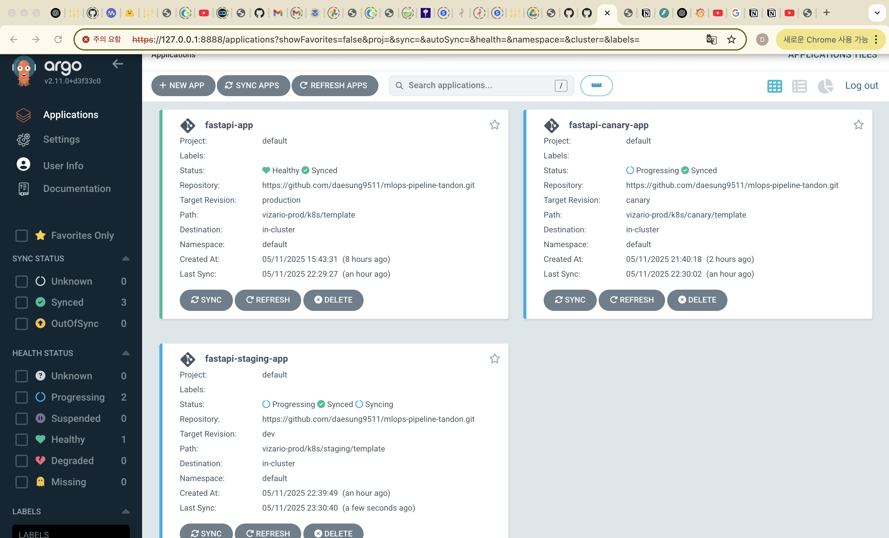
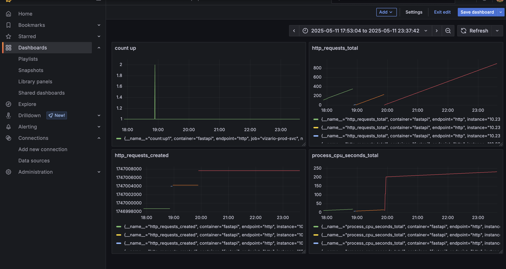

# Vizario: AI-Powered Meeting Intelligence Platform for Enhanced Organizational Productivity

## 1. Value Proposition

Our service is designed primarily for diplomats working at the United Nations. These diplomats often spend long hours each week attending meetings, after which they must analyze meeting transcripts and video recordings. Every year, the UN holds and records thousands of meetings, but manually reviewing and analyzing this vast amount of material demands significant time and human resources, making it a highly labor-intensive process.

To address this challenge, our service uses LLMs to generate customizable summaries of meeting proceedings tailored to users’ specific queries. This helps diplomats gain deeper and more personalized insights into the content of each meeting.

When analyzing meetings, diplomats must be careful to avoid misinterpretation. They also need to understand the remarks of speakers from a wide range of countries and recognize the complex political and social contexts involved. Therefore, nuanced and multi-layered analysis is essential. In summary, diplomats require: 1) accurate interpretation and 2) summaries that can be customized to fit their specific needs.

To meet these requirements, we use the QMSum dataset, which is designed for query-based summarization tasks. Additionally, we have developed our evaluation metrics to prioritize accuracy, even if it means accepting some delay in processing time.

## 2. Scale

### 2.1. Training Dataset: QMSum (173.08 MB)

- We use QMSum (https://github.com/Yale-LILY/QMSum) Dataset, which is total 173.08 MB.


### 2.2. Model: BART (1.58 GB)

- We use BART model (large size) for summarization task ([https://huggingface.co/docs/transformers/en/model_doc/bart](https://huggingface.co/facebook/bart-large)) loaded from Hugging Face Hub.
    
    
    

### 2.3. Model: Whisper (Base model, 139MB)

- We use OpenAI’s Whisper model (base size) for automatic speech recognition task loaded from `openai` API.


### 2.4. Training Time (15 min)

- From Wandb (only team members can access it) log: https://wandb.ai/yj3263-new-york-university/huggingface?nw=nwuseryj3263, the average training time (single GPU, 40GB) was **15 minutes**.
- The size of the deployment: ~**2000** requests per day (30 sec per request)


---

## 3. Cloud Native Infrastructure Diagram


---

## 4. Data Pipeline

### 4.1. Persistent Storage

For persistent storage, I made a guideline to easily mount the persistent storages to CHI and KVM instances: https://github.com/daesung9511/mlops-pipeline-tandon/blob/dev/mount_storage.md

We use 1) **object storage** for train dataset and 2) **block storage** for loading AI model parameters and saving model logs and data (MinIO).

1. Object storage has train dataset and BART pre-trained model parameters for initializing training process. In total, it occupies **2.5 GB**.


1. Block storage has MinIO data (online evaluation) and BART model parameters, which takes up to **1.6 GB**.


### 4.2. Offline Data


For example, `test.json` contains:

```bash
"speaker": "Grad D",
            "content": "So a more general thing than \" discussed admission fee \" um , could be {disfmarker} I {disfmarker} I 'm just wondering whether the context , the background context of the discourse {vocalsound} might be {disfmarker} I don't know , if there 's a way to define it or maybe you know generalize it some way um , there might be other cues that , say , um , in the last few utterances there has been something that has strongly associated with say one of the particular modes uh , I don't know if that might be {disfmarker}"
        },
        {
            "speaker": "Grad A",
            "content": "Mm - hmm . I think we {disfmarker}"
        },
        {
            "speaker": "Grad D",
            "content": "uh , and {disfmarker} and into that node would be various {disfmarker} various things that {disfmarker} that could have specifically come up ."
        },
```

### 4.3. Data Pipeline

1. First, we downloaded the train dataset (https://github.com/Yale-LILY/QMSum) locally in the server for training.
2. In the `1train_bart.py` (https://github.com/daesung9511/mlops-pipeline-tandon/blob/dev/Bart_training/1_train_bart.py), we use `load_dataset()` method to divide the dataset into train, evaluation and test datasets.
3. 

---

## 5. Model Training

### **5.1 Modeling**:

| **Field** | **Original QMSum (nested)** | **After Flattening (**.jsonl**)** |
| --- | --- | --- |
| meeting | full meeting object with QA list | only relevant QA pair included |
| qas | list of {query, answer} | **split into individual rows** |
| query | inside qas[0].query, qas[1].query… | now a **top-level field** |
| transcript | segmented turns | merged as "meeting_transcripts" |
| answer | list of spans | converted into full answer string |

### **5.2 Train and re-train**:

[1_train_bart.py](https://github.com/daesung9511/mlops-pipeline-tandon/blob/906e25a4544ec011a965bd4e9bc46160ff1ce019/Bart_training/1_train_bart.py)

[2-1_train_bart_ray.py](https://github.com/daesung9511/mlops-pipeline-tandon/blob/906e25a4544ec011a965bd4e9bc46160ff1ce019/Bart_training/2-1_train_bart_ray.py)

[2-2_train_bart_ray_accum2.py](https://github.com/daesung9511/mlops-pipeline-tandon/blob/906e25a4544ec011a965bd4e9bc46160ff1ce019/Bart_training/2-2_train_bart_ray_accum2.py)

[2-3_train_bart_ray_accum4.py](https://github.com/daesung9511/mlops-pipeline-tandon/blob/906e25a4544ec011a965bd4e9bc46160ff1ce019/Bart_training/2-3_train_bart_ray_accum4.py)

[2-4_train_bart_ray_accum8.py](https://github.com/daesung9511/mlops-pipeline-tandon/blob/906e25a4544ec011a965bd4e9bc46160ff1ce019/Bart_training/2-4_train_bart_ray_accum8.py)

### **5.3 Experiment tracking**:

 Wandb : https://wandb.ai/yj3263-new-york-university/huggingface?nw=nwuseryj3263

| **Training Name** | **BLEU         ↑** | **ROUGE1 ↑** | **BERT Score ↑** | **Loss ↓** | **Runtime ↓** | **Steps/sec ↑** | **Grad Norm Stability** | **time                 (min.)** |
| --- | --- | --- | --- | --- | --- | --- | --- | --- |
| **1) BART_1GPU** | Medium | Medium | Low | Medium | ❌ Slow  | ❌ Low | ⚠️ Unstable (spike occur) | 15 |
| **2-1) Ray_2GPU_basic** | High | High | High | Low | ✅ Fast | ✅ Medium | ✅ Stable | 8.25 |
| **2-2) Ray_2GPU_accum2** | Low | Low | Medium | Medium | ✅ Very fast | ✅ High | ✅ Stable | 4.25 |
| **2-3) Ray_2GPU_accum4** | Very High | Very High | High | Low | ✅ Very fast | ✅ High | ✅ Stable | 4 |
| **2-4) Ray_2GPU_accum8** | Best | Best | Best | Lowest | ✅ Very fast | ✅ Best | ✅ Very stable | 4 |

### **5.4 Scheduling training jobs**: Show your training and re-training setup.

  **- Baseline (1 GPU)**

- 1)train_bart.py
- Uses Hugging Face Trainer
- Manually executed
- Suitable for small-scale tests

 **- Ray Distributed Training (2 GPUs)**

- 2-1_train_bart_ray.py / 2-2_train_bart_ray_accum2.py / 2-2_train_bart_ray_accum4.py /       2-2_train_bart_ray_accum8.py
- Training logic wrapped in train_func()
- Launched via TorchTrainer:

```python
trainer = TorchTrainer(
    train_loop_per_worker=train_func,
    scaling_config=ScalingConfig(num_workers=2, use_gpu=True),
    run_config=RunConfig(
        name="2-2) Ray_2GPU_accum2",
        checkpoint_config=CheckpointConfig(num_to_keep=2),
    )
)
```

### **5.5 Optional: Training strategies for large models/Use distributed training to increase velocity**: If you hit these difficulty points, explain what you did! Include numbers (e.g. “training time decreased from X to Y due to training strategy Z.”)

| **Configuration** | **Runtime** | **Notes** |
| --- | --- | --- |
| BART_1GPU | ~15 min | Very slow and unstable |
| Ray_2GPU_accum2 | **4.25 min** | Fast, stable, higher throughput |
| Ray_2GPU_accum8 | ~4 min | Best quality and speed overall |

### **5.6 Optional: Using Ray Train or Ray Tune features**: If you hit these difficulty points, show off the relevant section of your code! Make sure I realize that you did it!

```python
trainer = TorchTrainer(
    train_loop_per_worker=train_func,
    scaling_config=ScalingConfig(num_workers=2, use_gpu=True),
    ...
)
```

DDP & FSDP Training - code error 

[3-1_train_bart_ray_ddp__(fail).py](https://github.com/daesung9511/mlops-pipeline-tandon/blob/906e25a4544ec011a965bd4e9bc46160ff1ce019/Bart_training/3-1_train_bart_ray_ddp__(fail).py)

[3-2_train_bart_ray_ddp_accum4__(fail).py](https://github.com/daesung9511/mlops-pipeline-tandon/blob/906e25a4544ec011a965bd4e9bc46160ff1ce019/Bart_training/3-2_train_bart_ray_ddp_accum4__(fail).py)

[4-1_train_bart_ray_fsdp__(fail).py](https://github.com/daesung9511/mlops-pipeline-tandon/blob/906e25a4544ec011a965bd4e9bc46160ff1ce019/Bart_training/4-1_train_bart_ray_fsdp__(fail).py)

[4-2_train_bart_ray_fsdp_accum4__(fail).py](https://github.com/daesung9511/mlops-pipeline-tandon/blob/906e25a4544ec011a965bd4e9bc46160ff1ce019/Bart_training/4-2_train_bart_ray_fsdp_accum4__(fail).py)


---

Unit 8: DATA PERSON - 1 minutes

**Online data**: Show how “new” data is sent to the inference endpoint during “production” use.

The production data (audio, 

MinIO config [[link](https://github.com/daesung9511/mlops-pipeline-tandon/blob/906e25a4544ec011a965bd4e9bc46160ff1ce019/vizario-staging/docker/docker-compose-prod.yaml#L37)]

MinIO App setup [link]

### 1. **Infrastructure and Infrastructure-as-code**

To provision and configure the infrastructure required for the project, I used **Terraform** to define and provision compute instances, networking components, and persistent storage on OpenStack. After provisioning, I used **Ansible** to configure the nodes (e.g., installing Docker, Kubernetes, and ArgoCD, Argo workflow), ensuring consistency and repeatability across environments. This approach allowed me to fully automate both the setup and configuration of the systems used in the MLOps pipeline.

### data.tf

```jsx
data "openstack_networking_network_v2" "sharednet3" {
  name = "sharednet3"
}

data "openstack_networking_subnet_v2" "sharednet3_subnet" {
  name = "sharednet3-subnet"
}

data "openstack_networking_secgroup_v2" "allow_ssh" {
  name = "allow-ssh"
}

data "openstack_networking_secgroup_v2" "allow_9001" {
  name = "allow-9001"
}

data "openstack_networking_secgroup_v2" "allow_8000" {
  name = "allow-8000"
}

data "openstack_networking_secgroup_v2" "allow_8080" {
  name = "allow-8080"
}

data "openstack_networking_secgroup_v2" "allow_8081" {
  name = "allow-8081"
}

data "openstack_networking_secgroup_v2" "allow_http_80" {
  name = "allow-http-80"
}

data "openstack_networking_secgroup_v2" "allow_9090" {
  name = "allow-9090"
}
```

### main.tf

```jsx
resource "openstack_networking_network_v2" "private_net" {
  name                  = "private-net-mlops-${var.suffix}"
  port_security_enabled = false
}

resource "openstack_networking_subnet_v2" "private_subnet" {
  name       = "private-subnet-mlops-${var.suffix}"
  network_id = openstack_networking_network_v2.private_net.id
  cidr       = "192.168.1.0/24"
  no_gateway = true
}

resource "openstack_networking_port_v2" "private_net_ports" {
  for_each              = var.nodes
  name                  = "port-${each.key}-mlops-${var.suffix}"
  network_id            = openstack_networking_network_v2.private_net.id
  port_security_enabled = false

  fixed_ip {
    subnet_id  = openstack_networking_subnet_v2.private_subnet.id
    ip_address = each.value
  }
}
resource "openstack_networking_secgroup_v2" "allow_nodeport" {
  name        = "allow-nodeport"
  description = "Allow incoming NodePort range for Kubernetes"
}

resource "openstack_networking_secgroup_rule_v2" "allow_nodeport_range" {
  direction         = "ingress"
  ethertype         = "IPv4"
  protocol          = "tcp"
  port_range_min    = 30000
  port_range_max    = 32767
  remote_ip_prefix  = "0.0.0.0/0"
  security_group_id = openstack_networking_secgroup_v2.allow_nodeport.id
}

resource "openstack_networking_port_v2" "sharednet3_ports" {
  for_each   = var.nodes
    name       = "sharednet3-${each.key}-mlops-${var.suffix}"
    network_id = data.openstack_networking_network_v2.sharednet3.id
    security_group_ids = [
    data.openstack_networking_secgroup_v2.allow_ssh.id,
      data.openstack_networking_secgroup_v2.allow_9001.id,
      data.openstack_networking_secgroup_v2.allow_8000.id,
      data.openstack_networking_secgroup_v2.allow_8080.id,
      data.openstack_networking_secgroup_v2.allow_8081.id,
      data.openstack_networking_secgroup_v2.allow_http_80.id,
      data.openstack_networking_secgroup_v2.allow_9090.id,
      openstack_networking_secgroup_v2.allow_nodeport.id]
}

resource "openstack_compute_instance_v2" "nodes" {
  for_each = var.nodes

  name        = "${each.key}-mlops-${var.suffix}"
  image_name  = "CC-Ubuntu24.04"
  flavor_name = "m1.xxlarge"
  key_pair    = var.key

  network {
    port = openstack_networking_port_v2.sharednet3_ports[each.key].id
  }

  network {
    port = openstack_networking_port_v2.private_net_ports[each.key].id
  }

  user_data = <<-EOF
    #! /bin/bash
    sudo echo "127.0.1.1 ${each.key}-mlops-${var.suffix}" >> /etc/hosts
    su cc -c /usr/local/bin/cc-load-public-keys
  EOF

}

resource "openstack_networking_floatingip_v2" "floating_ip" {
  pool        = "public"
  description = "MLOps IP for ${var.suffix}"
  port_id     = openstack_networking_port_v2.sharednet3_ports["node1"].id
}
```

### outputs.tf

```jsx
output "floating_ip_out" {
  description = "Floating IP assigned to node1"
  value       = openstack_networking_floatingip_v2.floating_ip.address
}
```

### variables.tf

```jsx
variable "suffix" {
  description = "Suffix for resource names (use net ID)"
  type        = string
  nullable = false
}

variable "key" {
  description = "Name of key pair"
  type        = string
  default     = "id_rsa_chameleon"
}

variable "nodes" {
  type = map(string)
  default = {
    "node1" = "192.168.1.11"
    "node2" = "192.168.1.12"
    "node3" = "192.168.1.13"
  }
}
```

### versions.tf

```jsx
terraform {
  required_version = ">= 0.14.0"
  required_providers {
    openstack = {
      source  = "terraform-provider-openstack/openstack"
      version = "~> 1.51.1"
    }
  }
}
```

### clouds.yaml

```bash
# This is a clouds.yaml file, which can be used by OpenStack tools as a source
# of configuration on how to connect to a cloud. If this is your only cloud,
# just put this file in ~/.config/openstack/clouds.yaml and tools like
# python-openstackclient will just work with no further config. (You will need
# to add your password to the auth section)
# If you have more than one cloud account, add the cloud entry to the clouds
# section of your existing file and you can refer to them by name with
# OS_CLOUD=openstack or --os-cloud=openstack
clouds:
  openstack:
    
    auth:
      
      auth_url: https://kvm.tacc.chameleoncloud.org:5000
      
      application_credential_id: "63415414d1f04508ab1b8a931413edeb"
      application_credential_secret: "XbYKEQLgyVsdZGilBOpRl_NdPn4X1CIka-4RMKTvnBs5mMJWab8oRblCT5tM9lw9qYpvEfhc_2gv4hO8t38E9A"
    
      
        
    region_name: "KVM@TACC"
        
      
    interface: "public"
    identity_api_version: 3
    auth_type: "v3applicationcredential"
```

### Differences Between Terraform Usage in This Project vs. the Lab

1. **Compute Resources**
    - **Lab**: Used smaller `m1.medium` instances suitable for basic workloads.
    - **Project**: Used larger `m1.xxlarge` instances to support resource-intensive workloads like model training, inference, and monitoring components.
2. **Security Groups**
    - In the **project**, we needed to explicitly open port ranges `30000–32057` to support Kubernetes `NodePort` services. This was not required in the lab, where such port exposure wasn’t necessary due to simpler architecture.

---

### 2. **Staged Deployment**

For model deployment across environments, I used **Argo CD** to implement a GitOps-based staged deployment workflow. The deployment process is defined declaratively in Git, and Argo CD watches the repository for changes. Whenever a model version is updated in Git, Argo CD automatically syncs and applies the changes to the Kubernetes cluster. I structured deployments into stages ( `staging`, `canary`, `production`) using Git branches, allowing the model to progress safely through the pipeline with visibility and rollback support.

Additionally, I integrated **Prometheus** to scrape metrics from the FastAPI app at each stage via a `/metrics` endpoint. The metrics are visualized in **Grafana dashboards**, allowing me to monitor performance, request counts, and health for each deployed stage (e.g., canary latency, staging throughput) in real time.



### Helm Chart for creating prometheus and grafana app on k8s

```bash
helm repo add prometheus-community https://prometheus-community.github.io/helm-charts
helm repo update

helm install prometheus prometheus-community/kube-prometheus-stack

```

### ArgoCD app yaml for staging

[mlops-pipeline-tandon/vizario-prod/k8s/staging/template](https://github.com/daesung9511/mlops-pipeline-tandon/tree/dev/vizario-prod/k8s/staging/template)

```yaml
apiVersion: argoproj.io/v1alpha1
kind: Application
metadata:
  name: fastapi-staging-app
  namespace: argocd
spec:
  destination:
    name: ''
    namespace: default
    server: 'https://kubernetes.default.svc'
  source:
    path: vizario-prod/k8s/staging
    repoURL: 'https://github.com/daesung9511/mlops-pipeline-tandon.git'
    targetRevision: staging
  sources: []
  project: default
  syncPolicy:
    automated:
      prune: true
      selfHeal: true
```

### ArgoCD app yaml for canary

[mlops-pipeline-tandon/vizario-prod/k8s/canary/template](https://github.com/daesung9511/mlops-pipeline-tandon/tree/dev/vizario-prod/k8s/canary/template)

```yaml
apiVersion: argoproj.io/v1alpha1
kind: Application
metadata:
  name: fastapi-canary-app
  namespace: argocd
spec:
  destination:
    name: ''
    namespace: default
    server: 'https://kubernetes.default.svc'
  source:
    path: vizario-prod/k8s/canary
    repoURL: 'https://github.com/daesung9511/mlops-pipeline-tandon.git'
    targetRevision: canary
  sources: []
  project: default
  syncPolicy:
    automated:
      prune: true
      selfHeal: true
```

### ArgoCD app yaml for production

[mlops-pipeline-tandon/vizario-prod/k8s/production/template](https://github.com/daesung9511/mlops-pipeline-tandon/tree/dev/vizario-prod/k8s/production/template)

```yaml
apiVersion: argoproj.io/v1alpha1
kind: Application
metadata:
  name: fastapi-app
  namespace: argocd
spec:
  destination:
    name: ''
    namespace: default
    server: 'https://kubernetes.default.svc'
  source:
    path: vizario-prod/k8s/production
    repoURL: 'https://github.com/daesung9511/mlops-pipeline-tandon.git'
    targetRevision: production
  sources: []
  project: default
  syncPolicy:
    automated:
      prune: true
      selfHeal: true
```

---

### 3. **CI/CD and Continuous Training**

Re-training is triggered when new data is committed to the dataset repository or a retraining job is manually scheduled. Once a new model is trained, it is automatically saved to a shared block persistent. The CI/CD pipeline then builds a new container image, pushes it to a registry, and Argo CD picks up the image tag update from Git to deploy it. This completes the retraining-to-redeployment loop, enabling continuous model improvement without manual intervention.
- whenever pushing the commit, the argocd will syncronize the image pushed by github ci/cd

[mlops-pipeline-tandon/.github/workflows/docker-publish-canary.yml](https://github.com/daesung9511/mlops-pipeline-tandon/blob/dev/.github/workflows/docker-publish-canary.yml)

[mlops-pipeline-tandon/.github/workflows/docker-publish-prod.yml](https://github.com/daesung9511/mlops-pipeline-tandon/blob/dev/.github/workflows/docker-publish-prod.yml)

[mlops-pipeline-tandon/.github/workflows/docker-publish.yml](https://github.com/daesung9511/mlops-pipeline-tandon/blob/dev/.github/workflows/docker-publish.yml)

### 4. Microservice Architecture

To support fast and modular deployment, I designed the system using a **microservice architecture**, where each core function—such as model inference (FastAPI), training orchestration, monitoring, and storage—is packaged as a **separate containerized service**. These services communicate via well-defined APIs, making them independently deployable and maintainable.
Each microservice is deployed on Kubernetes using **Argo CD**, and they are loosely coupled to allow fault isolation: if one service (e.g., model training) fails, it doesn’t affect the serving pipeline. For observability, each service exposes Prometheus-compatible metrics endpoints, and **Grafana dashboards** visualize their individual performance. This modular approach also allows me to update or scale each service (like the FastAPI canary deployment) independently, which is critical as the system scales.


![System Structure Diagram] (images/structure.png)
